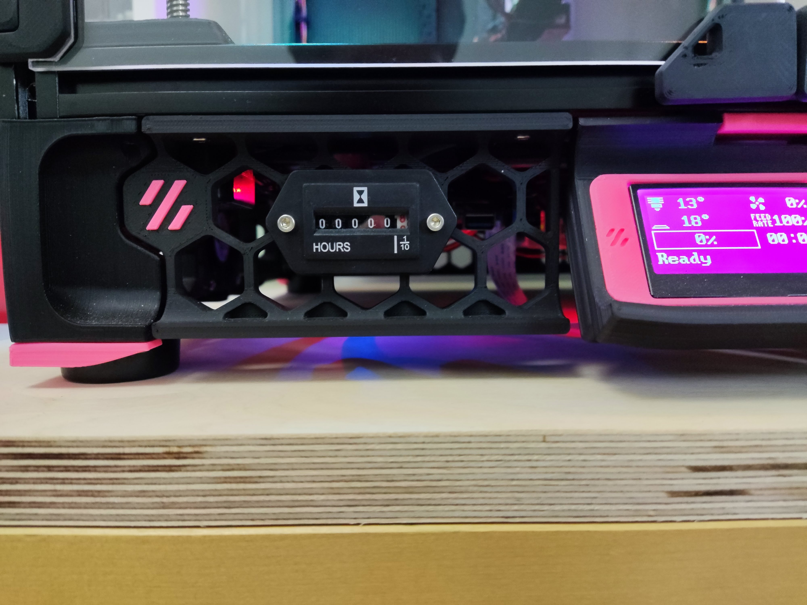
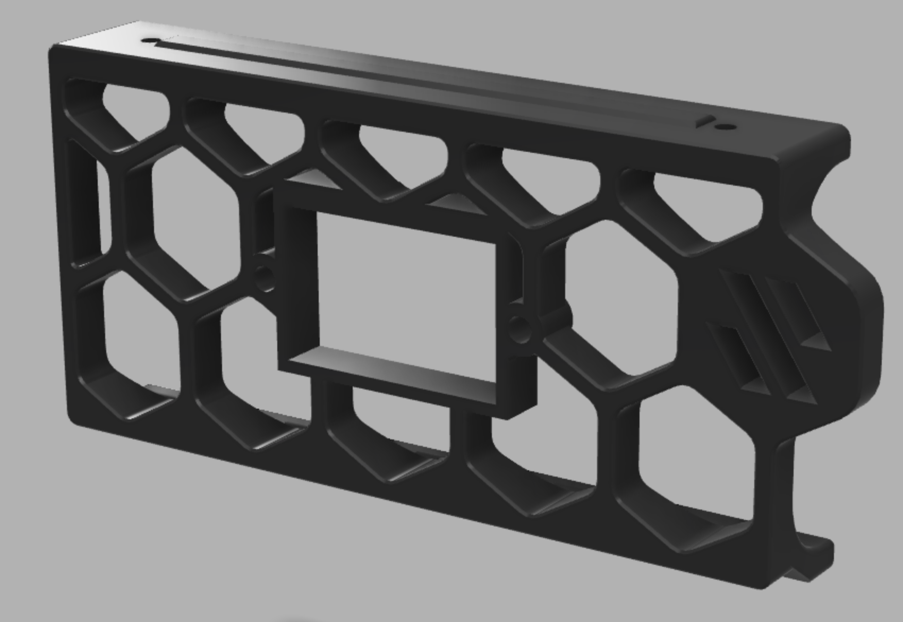

# Analog Timer Skirt Mount

Inspired from [Skirt mount for V0](https://github.com/VoronDesign/VoronUsers/tree/master/printer_mods/al3ph/analog_timer_mount). The skirt is the front left and can be installed in an any size Trident

## BOM

- [Hour Meter Quartz TimerAlliexrpess](https://www.aliexpress.com/item/799301917.html) **DC 10V/12V/24V/36V/80V**

## Files

- printable stl [analog_timer.stl](STLs/analog_timer.stl)
- fusion360 cad [analog_timer.f3d](CAD/analog_timer.f3d)

## Klipper Config

Get the DC version of the timer and connected it on a 24V output (I conncted it on an extra heater output on Spider). Define the following in the `printer.cfg` in klipper:

```
[output_pin digital_meter]
pin: PB15
pwm: False
value: 0
shutdown_value: 0

[gcode_macro START_METERING]
gcode:
    SET_PIN PIN=digital_meter VALUE=1

[gcode_macro STOP_METERING]
gcode:
    SET_PIN PIN=digital_meter VALUE=0
```

To start the timer call the `START_METERING` macro. Likewise to stop the time call the `STOP_METERING`

# Photos




